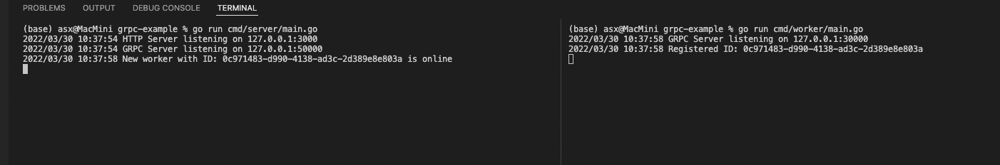

# GRPC-Example
### How to run:


### Call REST
```json
//request
{
  "worker_id": "62fd5389-e36d-4a80-b0fe-07a3f43f2490",
  "path": "worker/scripts/count.sh",
  "command": "bash"
}

// response
{
    "job_id": "f95cd669-d127-4aee-b3bd-2fb565a437c5"
}
```

### Reference:
Refactor from https://github.com/KorayGocmen/scheduler-worker-grpc (looks like unmaintained)
